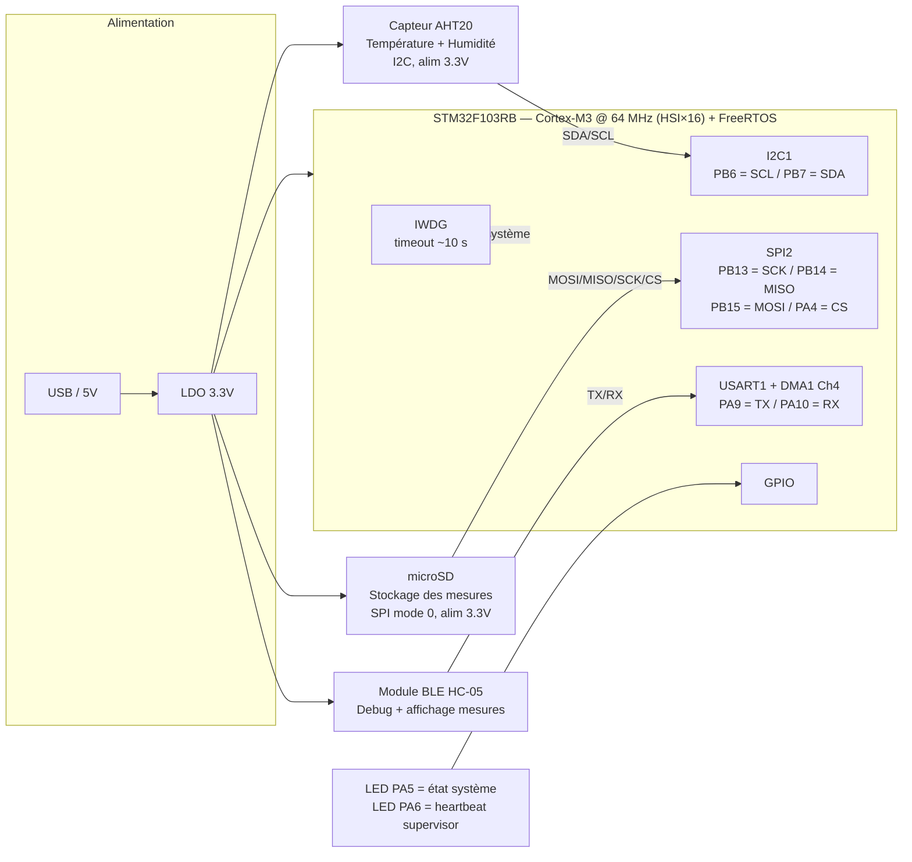
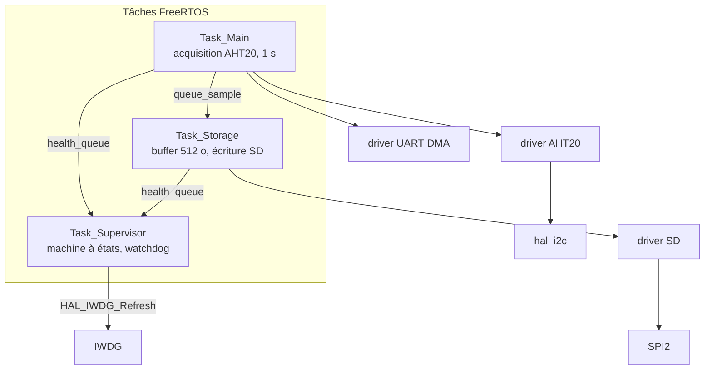
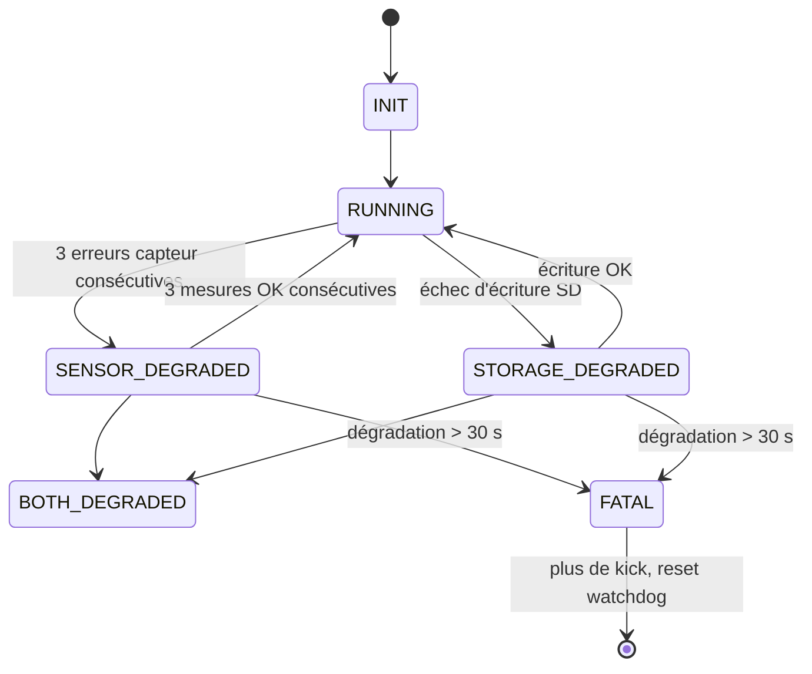

# Firmware-temps-reel-STM32-FreeRTOS-Data-Logger-
Développement d’un système embarqué autonome permettant l’acquisition, l’horodatage et l’enregistrement de données environnementales sur carte micro-SD avec une architecture temps réel sous FreeRTOS.

# SASE — Système d'Acquisition et de Stockage Environnemental

Enregistreur de température et d'humidité sur STM32F103RB, basé sur FreeRTOS. Il mesure, affiche et stocke les données sur carte microSD, avec une supervision logicielle et un watchdog matériel qui le remettent en route en cas de panne.

Le projet vise une démarche proche de l'industrie : drivers écrits sans bibliothèque tierce, gestion explicite de chaque cas d'erreur, tests par injection de pannes.

## Matériel

| Fonction | Composant | Interface / Broches |
|---|---|---|
| MCU | STM32F103RB (Nucleo), HSI ×16 = 64 MHz | — |
| Capteur température/humidité | AHT20 | I2C1 : PB6 (SCL) / PB7 (SDA) |
| Stockage | Module microSD | SPI2 : PB13 (SCK) / PB14 (MISO) / PB15 (MOSI), CS sur PA4 |
| Debug et affichage des mesures | Module Bluetooth HC-05 | USART1 : PA9 / PA10, TX en DMA1 Channel 4 |
| LED état système | LED | PA5 |
| LED heartbeat du Supervisor | LED | PA6 |
| Watchdog | IWDG matériel, timeout ≈ 10 s | Nourri uniquement par `Task_Supervisor` |

## Fonctionnement

- Une mesure par seconde (AHT20, avec vérification CRC).
- Chaque mesure est affichée sur l'UART.
- Seules les mesures valides sont stockées sur la microSD, par blocs de 512 octets.
- Au redémarrage, l'écriture reprend au bloc suivant (position persistée sur la carte).
- Si une panne dure trop longtemps, le système cesse de nourrir le watchdog et redémarre proprement.


## Architecture Diagramme de blocs matériel


## Architecture logicielle



Architecture en couches : tâches, drivers (AHT20, SD, UART), puis HAL STM32. Une tâche ne parle jamais directement à la HAL.

### Tâches

| Tâche | Rôle | Période |
|---|---|---|
| `Task_Main` | Lit l'AHT20, affiche, envoie l'échantillon à `Task_Storage`, compte ses erreurs consécutives | 1 s |
| `Task_Storage` | Accumule les échantillons valides en RAM, écrit un bloc SD quand il est plein, persiste le pointeur d'écriture | Sur événement |
| `Task_Supervisor` | Reçoit les rapports de santé, gère la machine à états et décide du kick du watchdog | ≤ 1 s |

Principes retenus :

- **Découplage par queue** : `Task_Main` envoie sans jamais attendre (timeout 0), une SD lente ne perturbe donc pas l'acquisition.
- **Les erreurs UART ne remontent pas au Supervisor** : elles n'affectent pas la mission de mesure et de stockage.
- **Une seule queue de santé** (`health_queue`) avec un champ source (capteur ou stockage) et un code d'erreur brut.

### Supervision



- Deux chronomètres indépendants (capteur et stockage) de 30 s avant `FATAL`.
- Le Supervisor attend sur la queue avec un timeout calculé, plafonné à 1 s pour que la boucle (et donc le kick) tourne toujours.
- Retour à `RUNNING` seulement après plusieurs succès consécutifs, jamais au premier.

### Watchdog (IWDG)

- Timeout ≈ 10 s (le LSI varie de 30 à 60 kHz selon les puces, la durée réelle est donc approximative).
- Démarré par le Supervisor après la première boucle de chaque tâche, pour ne pas reseter pendant l'initialisation de la SD.
- Un seul point de kick, et uniquement si l'état n'est pas `FATAL` et que les compteurs de vie (heartbeat) de `Task_Main` et `Task_Storage` progressent.
- En `FATAL`, le système cesse volontairement de nourrir le watchdog et redémarre (fail-safe par reset).
- Au démarrage, la cause du reset est lue (`RCC_FLAG_IWDGRST`) et loguée.

## Stockage sur microSD

Accès en blocs bruts de 512 octets, sans système de fichiers : les données ne sont relues que par le firmware lui-même.

| Bloc | Contenu |
|---|---|
| 999 | Métadonnées : magic number, prochain bloc à écrire, compteur d'écritures |
| 1000 à 50999 | Zone de logs en buffer circulaire |

Format d'un échantillon (8 octets) :

```c
typedef struct {
    uint8_t temp_int;
    uint8_t temp_frac;
    uint8_t hum_int;
    uint8_t hum_frac;
    SensorStatus st;   // 4 octets (enum)
} syste;
```

Capacité : 64 échantillons par bloc, soit un bloc écrit toutes les 64 s à 1 Hz. La zone réservée de 50 000 blocs contient environ 3,2 millions d'échantillons, soit **environ 37 jours** à 1 mesure par seconde avant bouclage. Convertir `SensorStatus` en `uint8_t` ferait passer l'échantillon à 5 octets (102 par bloc).

Le pointeur d'écriture est relu au démarrage et validé par le magic number (reprise après reset), puis mis à jour après chaque bloc écrit.

### Driver SD (mode SPI)

- Initialisation : 74 coups d'horloge CS haut, CMD0, CMD8, CMD55/ACMD41 (boucle jusqu'à 1 s), CMD58 (détection SDSC/SDHC), initialisation à faible vitesse puis passage en vitesse rapide.
- Lecture (CMD17) et écriture (CMD24) : CS maintenu bas pendant toute la transaction, y compris la phase de données.
- Écriture : token `0xFE`, 512 octets, CRC factice, vérification du data response token, attente de fin de busy avec timeout.
- Adressage : numéro de bloc (SDHC) ou octets (SDSC).

## Gestion des erreurs

| Source | Détection | Réaction |
|---|---|---|
| I2C | NACK, TIMEOUT, BUSY, BUS ERROR traduits en codes distincts | Compteur d'erreurs consécutives, rapport au Supervisor |
| Capteur | CRC invalide, mesure pas prête | Échantillon ignoré, non stocké |
| SD | Échec de commande, data response, timeout busy | Rapport au Supervisor |
| UART | `HAL_BUSY`, timeout | Local, sans impact sur l'état système |
| Tâche bloquée | Heartbeat figé | Plus de kick, reset watchdog |

## Tests

Tests réalisés par injection de pannes :

| # | Scénario | Résultat attendu | Résultat |
|---|---|---|---|
| 1 | Capteur débranché 5 s puis rebranché | `SENSOR_DEGRADED` puis retour `RUNNING`, sans reset |3 fois Sensor_OK |
| 2 | Capteur débranché plus de 30 s | `FATAL`, reset watchdog, reprise au bon bloc | Status_fatal |
| 3 | Carte SD retirée | `STORAGE_DEGRADED`, puis `FATAL` au-delà de 30 s | idem |
| 4 | Boucle infinie dans `Task_Main` | Reset par watchdog |Validé |
| 5 | Écriture puis relecture d'un bloc SD | Contenu identique | validé |
| 6 | Coupure d'alimentation et redémarrage | Reprise au bloc suivant | validé |

## Problèmes rencontrés et leçons

- **MISO configurée en `GPIO_MODE_AF_PP` sur STM32F1** : la ligne était pilotée en sortie, la lecture SD ne renvoyait que des `0xFF`. Correction : MISO en entrée avec pull-up.
- **CS relevé entre CMD17/CMD24 et la phase de données** : la carte abandonne la transaction. Correction : CS géré par l'appelant pendant toute la durée de la transaction.
- **Octet parasite envoyé avant le token d'écriture** (variable non initialisée) : R1 illisible et décalage du flux.
- **Écriture DMA UART** : `USART1_IRQHandler` est indispensable en plus du handler du canal DMA, sinon le callback de fin d'émission n'est jamais appelé et la HAL reste en `BUSY`.
- **Création de tâche en échec** : heap FreeRTOS (`configTOTAL_HEAP_SIZE`) trop petit.
- **Tâche suspendue par erreur** : un `vTaskSuspend` après un échec d'initialisation masquait le diagnostic.

## À faire

- Ré-initialisation automatique de la SD et bus recovery SPI.
- Ré-initialisation automatique de la capteur et bus recovery I2C.
- Relecture de l'historique et commandes via la liaison Bluetooth.

## 📸 Aperçu du projet


## Compilation et flash

À compléter : outil de build (CubeIDE, CMake...), version du firmware package STM32F1, procédure de flash.
